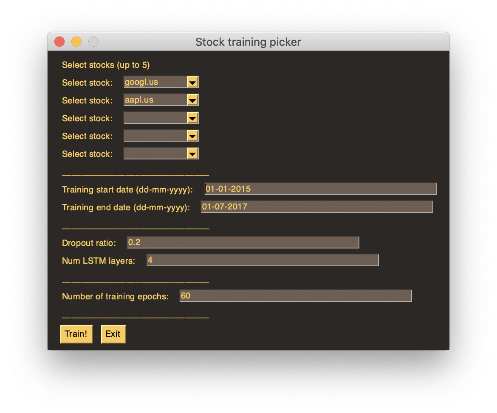
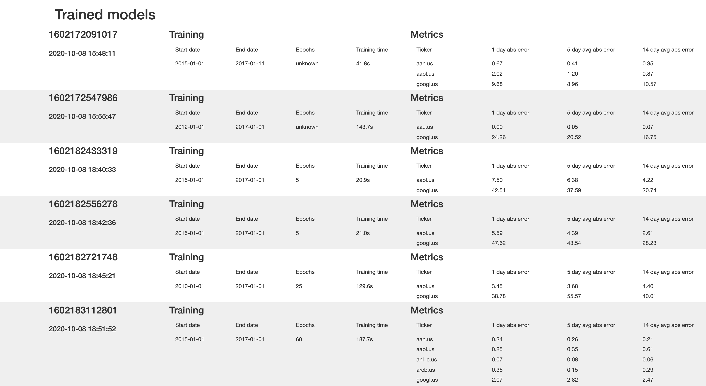

# Udacity Data Science Capstone Project

This repo contains code to train a LSTM model on stock data.

Automatically generates a small HTML report that shows an overview of trained models.

A GUI is available to select:

- stocks (tickers) to train on
- date range for training data
- number of epochs.

# How to use

## Train a model

Start the GUI by running:

`python train_gui.py`

The window below will open, select the stocks and dates you want to train on and press *Train!*. By default Google and Apple stocks are selected.

## Compare models

Open `models_report.html` to see the overview of previously trained models, an example can be found at `example_report.html`.

# Requirements

Requirements can be found in `requirements.txt` and installed using `pip install -r requirements.txt`.

# Links

Stock market dataset from Kaggle [here](https://www.kaggle.com/borismarjanovic/price-volume-data-for-all-us-stocks-etfs)

Read about a simple LSTM implementation on KDNugget [here](https://www.kdnuggets.com/2018/11/keras-long-short-term-memory-lstm-model-predict-stock-prices.html)

This repo is hosted on Github [here](https://github.com/sijmenw/udacity-data-science-capstone)