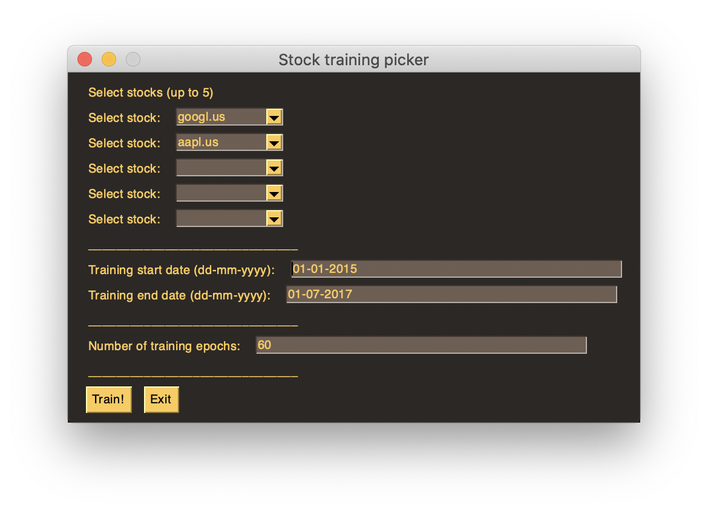

# Udacity Data Science Capstone Project

This repo contains code to train a LSTM model on stock data, generates a small HTML report that shows an overview of trained models.

A GUI is available to select stocks (tickers) to train on, as well as the date range and number of epochs.

# How to use

Start the GUI by running:

`python train_gui.py`

The window below will open, select the stocks and dates you want to train on and press *Train!*. By default Google and Apple stocks are selected.

Open `models_report.html` to see the overview of previously trained models.

# Requirements

Requirements can be found in `requirements.txt`

